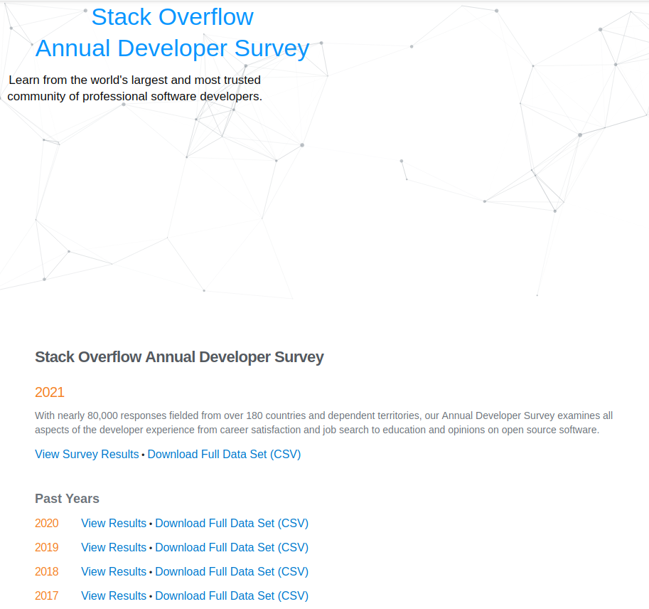
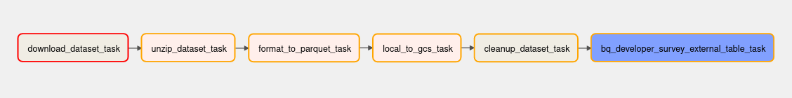
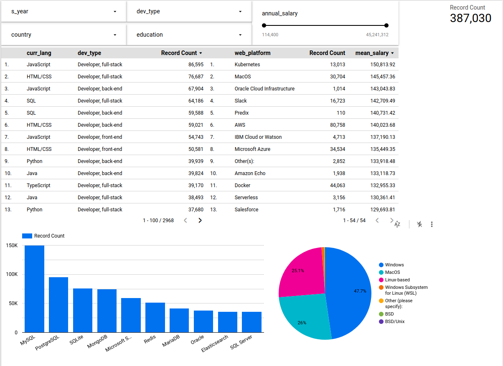

# de-zoomcamp-project by Maxim Popov

## Problem Description
The purpose of this project is to analyse trends in software development and reated spheres by reviewing developer survey data over past 5 years.
To accomplish this task, I aggregate publicly available data from [StackOverflow developer survey](https://insights.stackoverflow.com/survey) and create a dashboard for result visualisation.

## Data collection
First part of the solution is data collection. For this purpose I created an [Airflow DAG](airflow/dags/stackoverflow_to_bq_dag.py), which collects data by years, adds a corresponding 'year' field to each table, and uploads it to a data lake on Google Cloud Storage, using which it then creates tables in BigQuery. Python requirements are listed in the [corresponding file](airflow/requirements.txt)

## Data Transformations
At this point, data from each year is stored in a separate table, so there is no need in data optimization. There are big differences in table contents, so, in order to aggregate them into one table, [dbt](dbt/models/core/dev_survey.sql) is used for transformations. 
Firsty, only 19 relevant fields were extracted by comparison of different tables, containing from 50 to 150 fields each, so that there is a common ground for comparison of data from different years. 
Secondly, fields, containing answers to questions with multiple options, were transformed into arrays, so that distinct values could be easily looked up in the dashboard.
And at last, all fields were uniformly renamed according to SQL naming policy.
After all tables are merged by dbt into a single table in BigQuery, it was partitioned by year and clustered by country for faster lookup.
## Dashboard
Based on this data, a [dashboard](https://datastudio.google.com/reporting/13dd9b1e-d818-4551-afa9-803136d4a070) was produced. It visualises most popular programming languages, database management software and operating systems. Also it shows an average salary and popularity of different developer types in IT. Also it allows to filter data by the year of survey, developer type, country, and education level of respondents.

## Instructions to reproduce:
#### 1. Airflow
 
  1.0. Modify docker-compose environment variables: 
   ``` GCP_PROJECT_ID``` and ```GCP_GCS_BUCKET```
    
   and put your google cloud credentials to
   ``` /.google/credentials/google_credentials.json```

  1.1. Build the image (only first-time, or when there's any change in the `Dockerfile`, takes ~15 mins for the first-time):
     ```
   docker-compose build
     ```
   
or (for legacy versions)
   

```docker build``` .


 1.2. Initialize the Airflow scheduler, DB, and other config
    ```shell
    docker-compose up airflow-init
    ```

 1.3. Kick up the all the services from the container:
    ```shell
    docker-compose up
    ```

 1.4. In another terminal, run `docker-compose ps` to see which containers are up & running (there should be 7, matching with the services in your docker-compose file).

 1.5. Login to Airflow web UI on `localhost:8080` with default creds: `airflow/airflow`

 1.6. Run your DAG on the Web Console.
   
#### 2.DBT
2.1. Link your data warehouse to DBT
2.2. Copy all contents of `models` folder in this repo to `models` folder in dbt repository
2.3. Modify [schema.yml](dbt/models/staging/schema.yml) with your database name in GCP
2.4. Run command `dbt run --select +dev_survey` in order to run table merging after all ancestors

#### 3.BigQuery
Run ```create or replace table PROJECT_NAME.DATABASE_NAME.dev_survey_part_clust partition by RANGE_BUCKET(s_year, GENERATE_ARRAY(2017, 2022, 1)) cluster by country as SELECT * FROM PROJECT_NAME.DATABASE_NAME.dev_survey``` after replacing `PROJECT_NAME` and `DATABASE_NAME` with corresponding names from your GCP project to optimize queries.
